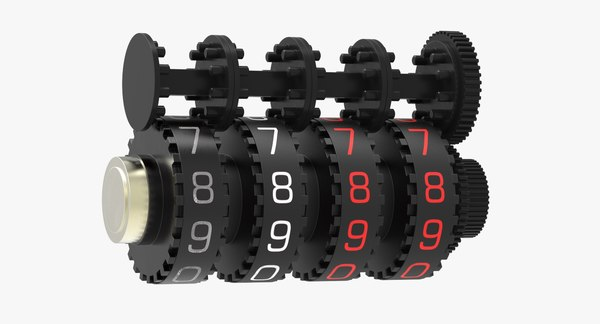
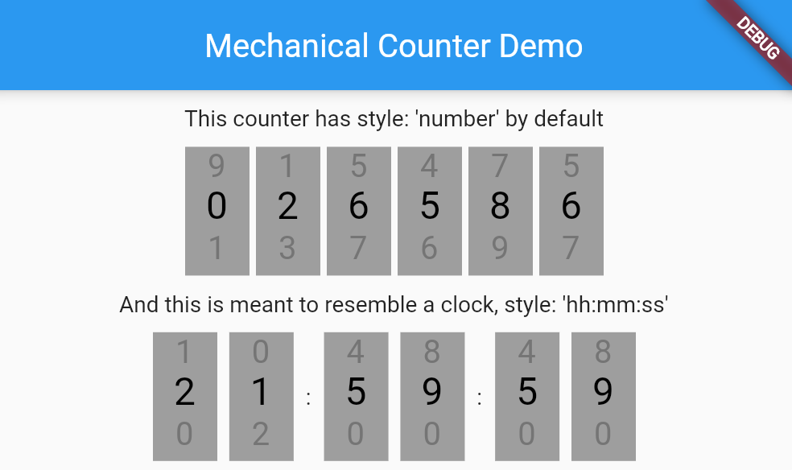

# Mechanical Counter plugin for Flutter

[](https://pub.dartlang.org/packages/mechanical_counter)

A Flutter plugin for iOS and Android for interacting with numbers from a familiar interface mimicking a mechanical digital counter.

|    Real thing     |   In Chrome    |
| :---------------------: | :-------------------: |
|  |  |

## Installation

First, add `mechanical_counter` as a [dependency in your pubspec.yaml file](https://flutter.io/platform-plugins/).

### iOS

No configuration required - the plugin should work out of the box.

### Android

No configuration required - the plugin should work out of the box.

### Example

``` dart
import 'dart:io';

import 'package:flutter/material.dart';
import 'package:mechanical_counter/mechanical_counter.dart';

void main() => runApp(MyApp());

class MyApp extends StatelessWidget {
  @override
  Widget build(BuildContext context) {
    return MaterialApp(
      home: MyHomePage(),
    );
  }
}

class MyHomePage extends StatefulWidget {
  @override
  _MyHomePageState createState() => _MyHomePageState();
}

class _MyHomePageState extends State<MyHomePage> {

  @override
  Widget build(BuildContext context) {
    return Scaffold(
      appBar: AppBar(
        title: Text('Mechanical Counter Example'),
      ),
      body: Center(
        MechanicalCounter(
          digits: 6,
          onChanged: (newValue) => print("Value changed to $newValue")),
        ),
      ),
    );
  }
}
```
